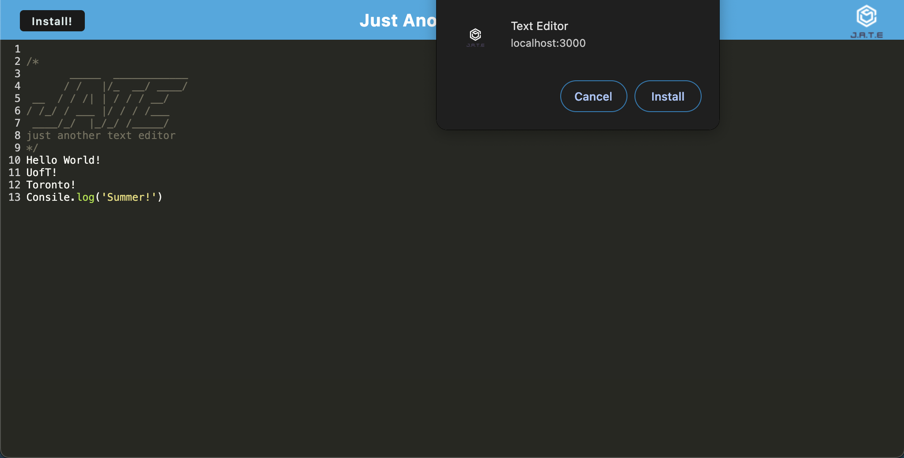

# Thoughts

## Description

JATE is a simple text editor built using JavaScript. It allows users to create, edit, and save text content in a local IndexedDB database.

## Content  

- [Walkthrough](#Walkthrough)
- [Features](#Features)
- [Screenshots](#Screenshots)
- [Usage](#Usage)
- [Database](#Database)
- [Contributing](#Contributing)
- [Questions](#Questions)

## Link of deployed application

- https://jate-7y73.onrender.com 

## Features

- Database Storage: JATE uses IndexedDB to store text content locally on the user's device.
- Create and Edit: Users can create new text entries and edit existing ones.
- Webpack Build: The app is bundled using Webpack for better code organization and performance.
- Progressive Web App (PWA): JATE is designed as a PWA, ensuring a seamless experience for users, even in offline mode.

## Screenshots of application

## Usage

- Run the development server: npm run start
- Open the app in your browser: http://localhost:3000

## Database

JATE uses IndexedDB for local storage. The database is initialized and upgraded using the idb library. The putDb method adds content to the database, while the getDb method retrieves content.

## Contributing

Contributions are welcome!

## Questions
If you have any questions or issues, please feel free to reach out:
- GitHub: https://github.com/DamirFM

